<div align="center">

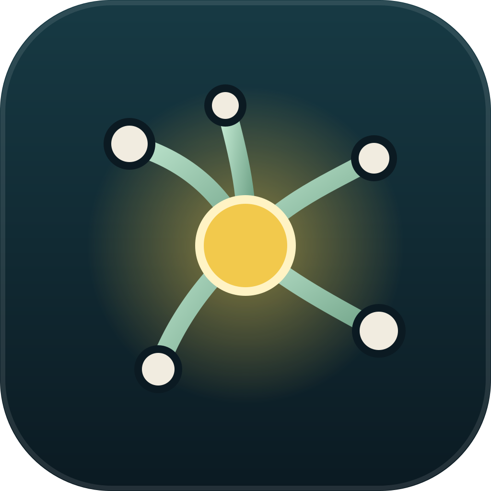

# Second Brain Studio

**Your second brain with Claude Code, Codex and Antigravity, in one window.**
Plain Markdown notes kept up to date by your assistants, their real command-line tools in tabs next to them,
and every PC in sync through your own private GitHub repository.

[](https://github.com/Axelina23/second-brain-studio/releases/latest)
[](app/requirements.txt)
[](LICENSE.md)
[](#features)

[Features](#features) · [How it works](#how-it-works) · [Install](#install) · [FAQ](#faq) · [Contributing](#contributing) · [🇮🇹 Italiano](docs/README.it.md)

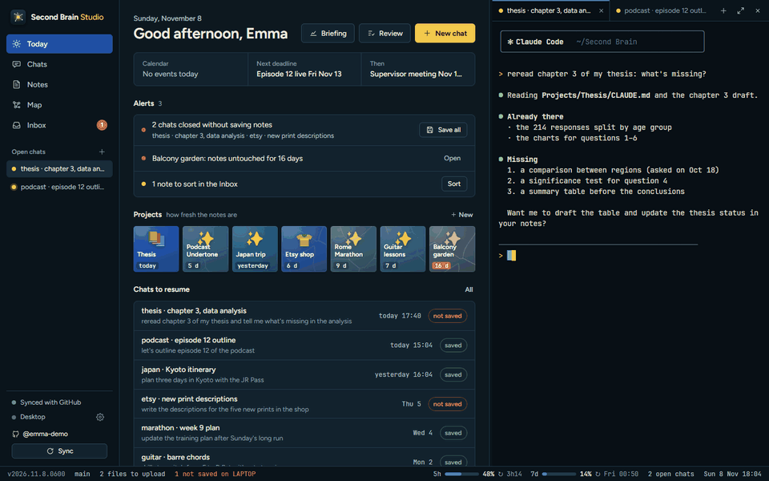

<sub>All screenshots use made-up data: Emma, her thesis, her podcast and her balcony garden don't exist.</sub>

</div>

## Why

Claude Code is great at remembering things **if you give it a place to remember them**: a folder of notes
with your rules, your projects and a log of what happened. Second Brain Studio is the home for that folder.

- You open the app and see **what changed, what's stale and which chats you never saved**.
- Work with **Claude Code, Codex or Antigravity in their real CLIs**, with their own accounts and permissions.
- When a chat ends in Studio, your configured assistant **updates the notes in the background**: the log, project status and index.
- Everything is **plain files** on your disk, versioned with git, backed up to a **private GitHub repo**.

## Claude Code, Codex and Antigravity

Choose the assistant and model for each new chat. Studio runs the installed CLI with its own account; it does not provide a subscription or replace the assistant's permissions.

- **Claude Code:** existing sign-in, native conversation forks and plan usage bars.
- **Codex:** sign in from **Settings > Assistant accounts**; choose the configured default or a model family and version. Review Studio's hooks with `/hooks` when Codex requests it.
- **Antigravity (`agy`):** install and sign in using Antigravity, then choose it in Studio. Its account remains managed by Antigravity.
- Across assistants: resume, rename, pin, search, export, delete and restore chats. Automatic notes run after closing a tab in Studio; choose their assistant and model in Settings. Chats opened outside Studio need **Save notes**.
- Usage indicators depend on what each assistant exposes; they are not identical across providers. Conversation duplication uses Claude's native fork and is only offered for Claude.

<table><tr>
<td width="50%">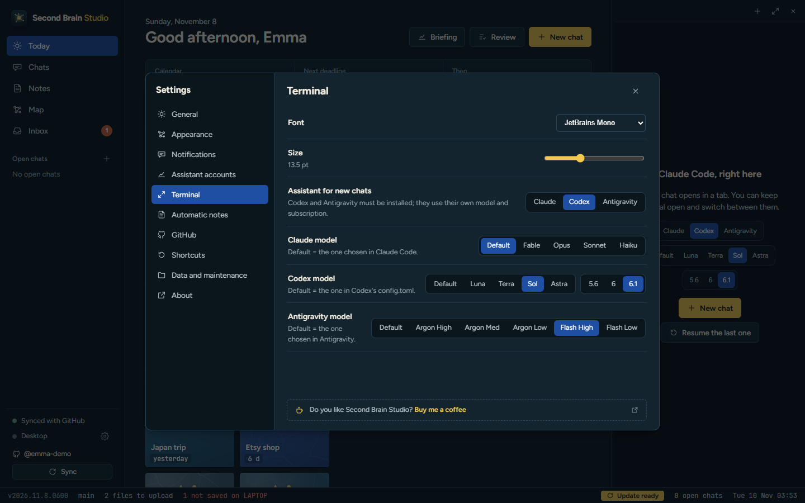<br>Choose Codex and its model family.</td>
<td width="50%">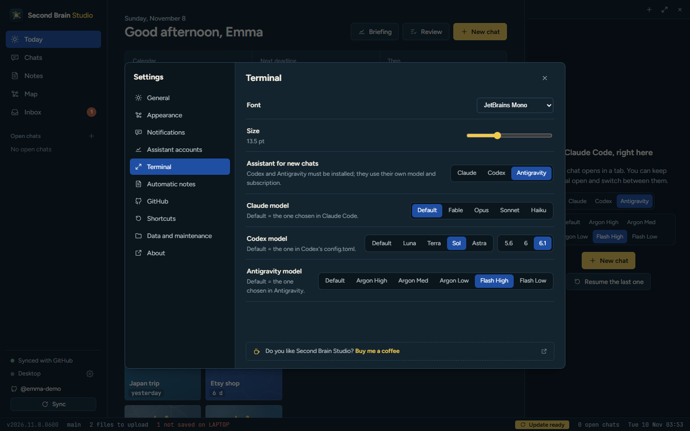<br>Choose Antigravity and its model.</td>
</tr></table>

Screenshots are interface previews using fictional data; they do not show real accounts or live assistant conversations.

## Features

<div align="center">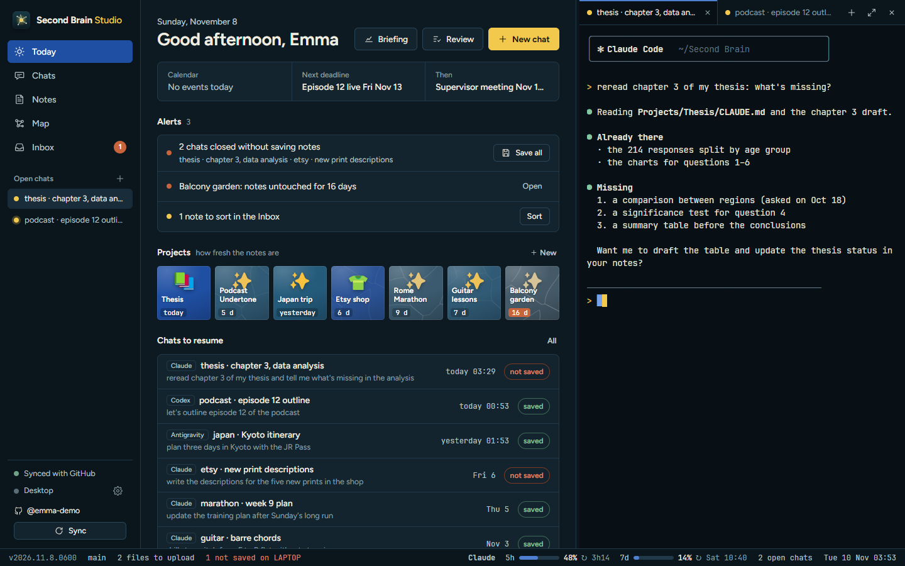</div>

<table>
<tr>
<td width="50%">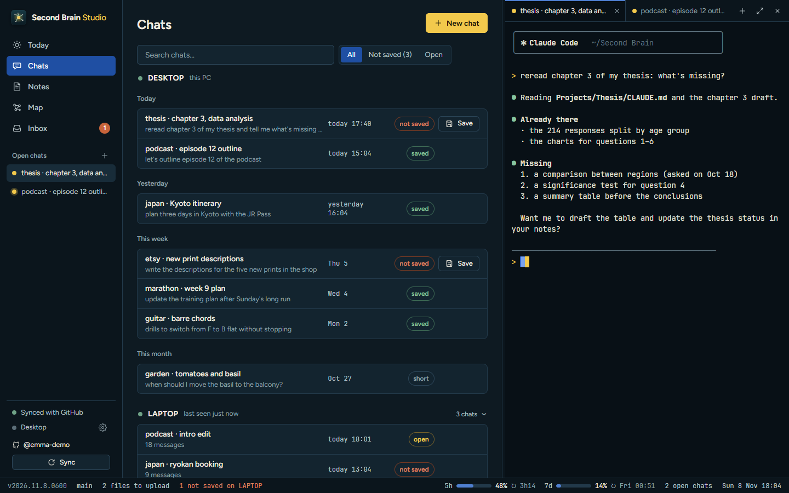</td>
<td width="50%">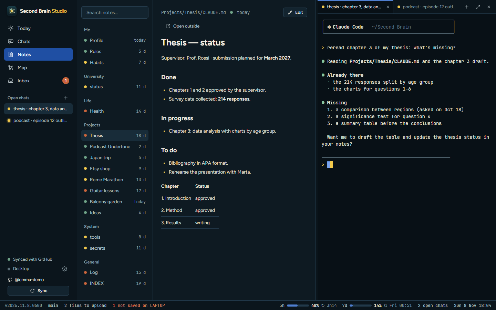</td>
</tr>
<tr>
<td><b>Every chat, on every PC.</b> Chats are grouped by day with their keywords and save status. Chats on your
other PCs show up too, live and read-only: you can tell at a glance if you left one open on the laptop.</td>
<td><b>Notes you can read.</b> Markdown rendered properly, a freshness dot for every file, full-text search,
quick edits in place. Big rewrites are Claude's job.</td>
</tr>
<tr>
<td>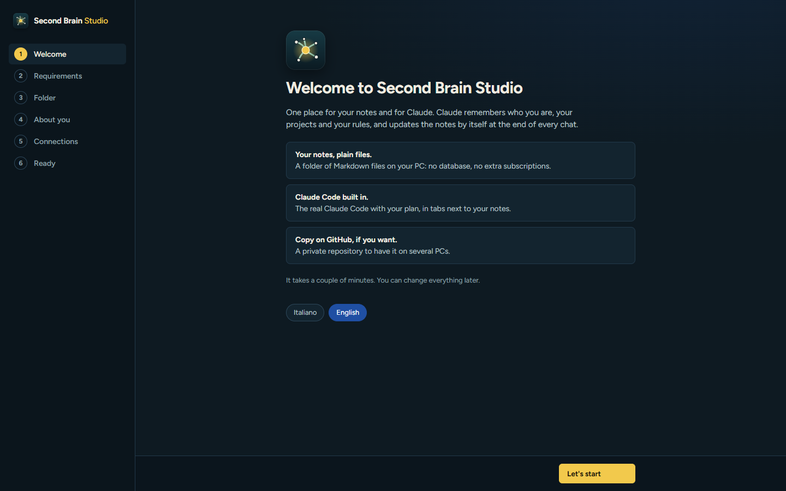</td>
<td>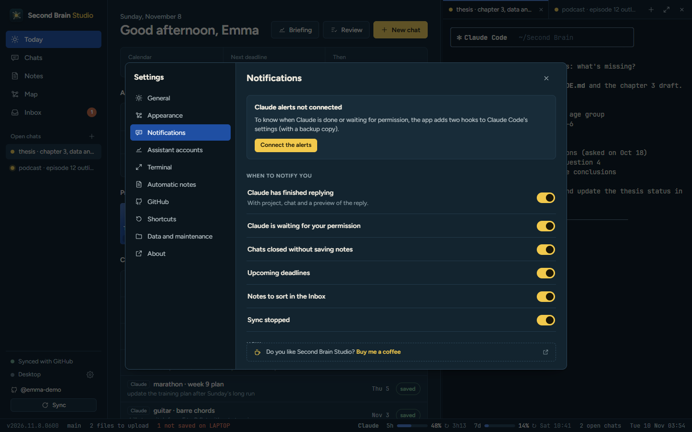</td>
</tr>
<tr>
<td><b>Set up in two minutes.</b> A guided first run creates the folder, asks a few questions (areas of your life,
answer style, rules Claude must follow) and writes the rules and index Claude reads in every chat.</td>
<td><b>Settings for everything.</b> Theme, accent color, notifications ("Claude has finished", "Claude is waiting
for your permission"), quiet hours and full-screen silence, terminal font, automatic notes, sync, updates.</td>
</tr>
</table>

### Eight ways to look at your second brain

Color by area or by freshness: stale notes fade like old tiles.

<table>
<tr>
<td width="50%">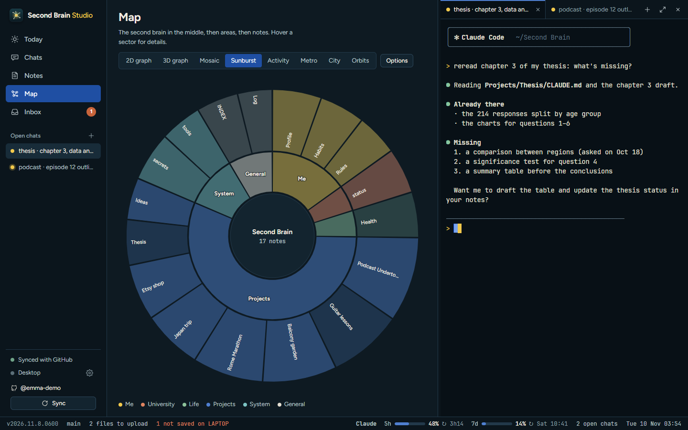<br><b>Sunburst</b>: areas, then notes</td>
<td width="50%">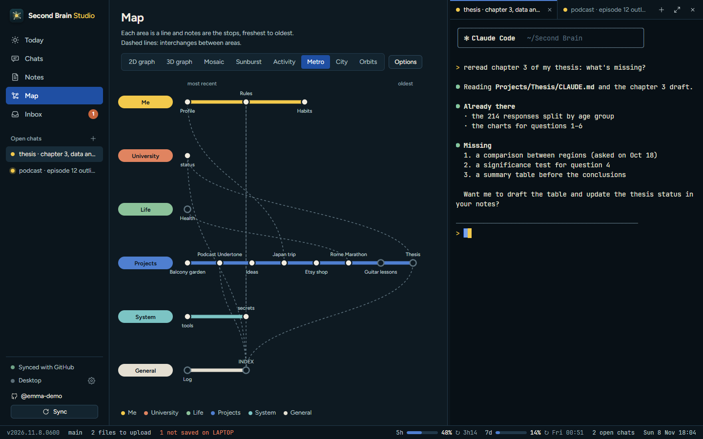<br><b>Metro</b>: one line per area, freshest first</td>
</tr>
<tr>
<td>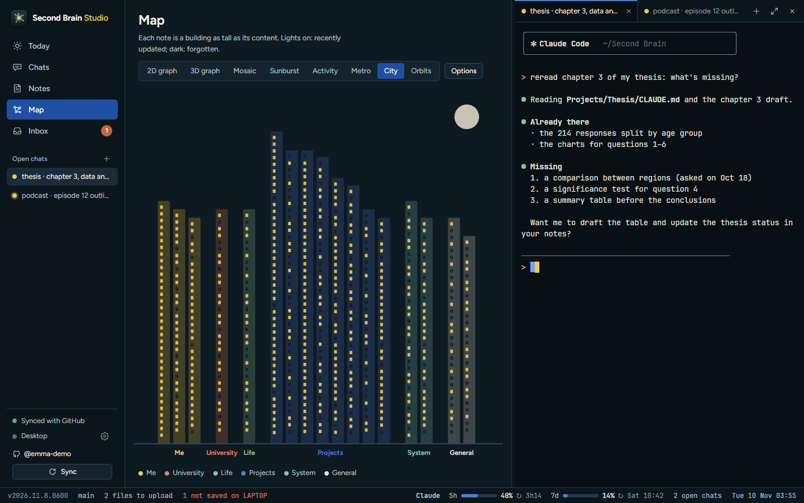<br><b>City</b>: tall buildings hold more, dark windows are forgotten</td>
<td>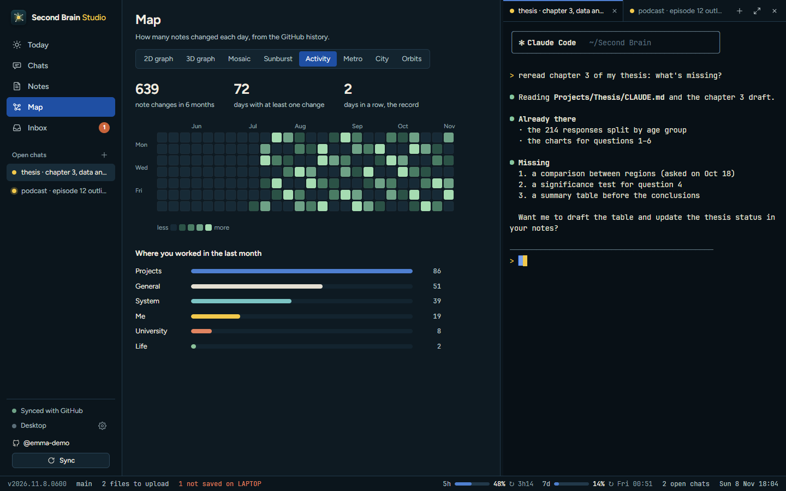<br><b>Activity</b>: what changed each day, from git history</td>
</tr>
</table>

<details>
<summary>The other four views: 2D graph, 3D graph, mosaic, orbits</summary>
<br>
<table>
<tr>
<td width="50%">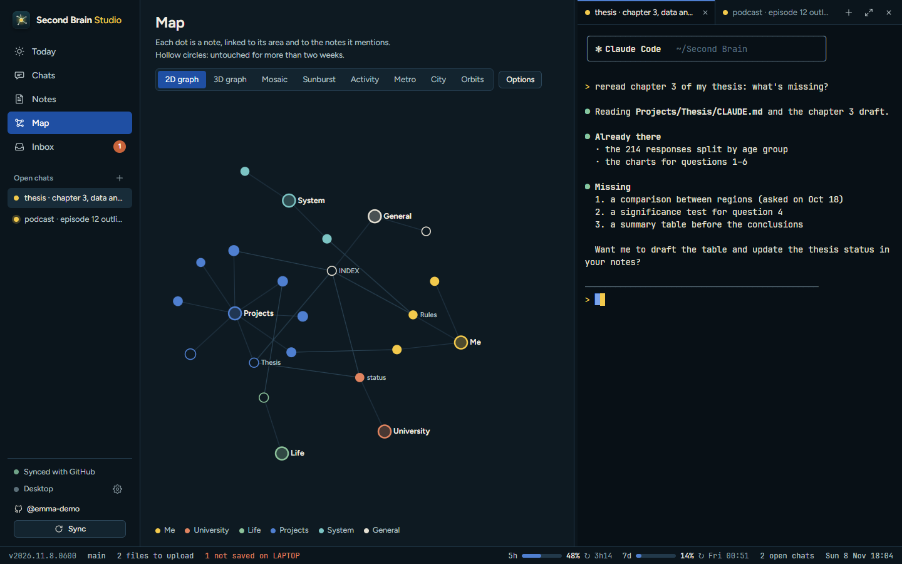<br><b>2D graph</b>: notes linked to their area and to the notes they mention</td>
<td width="50%">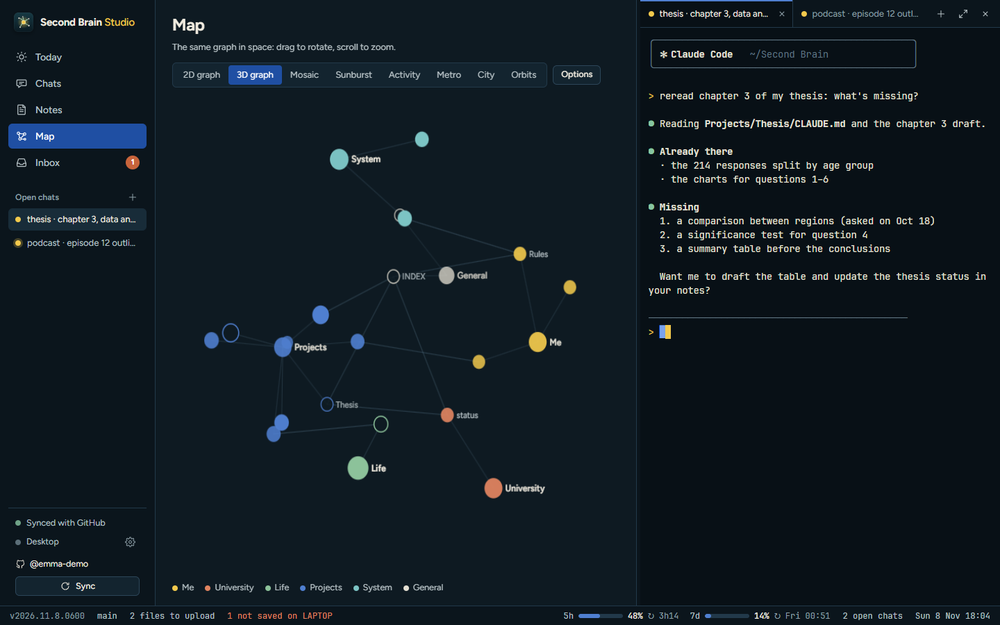<br><b>3D graph</b>: the same, in space</td>
</tr>
<tr>
<td>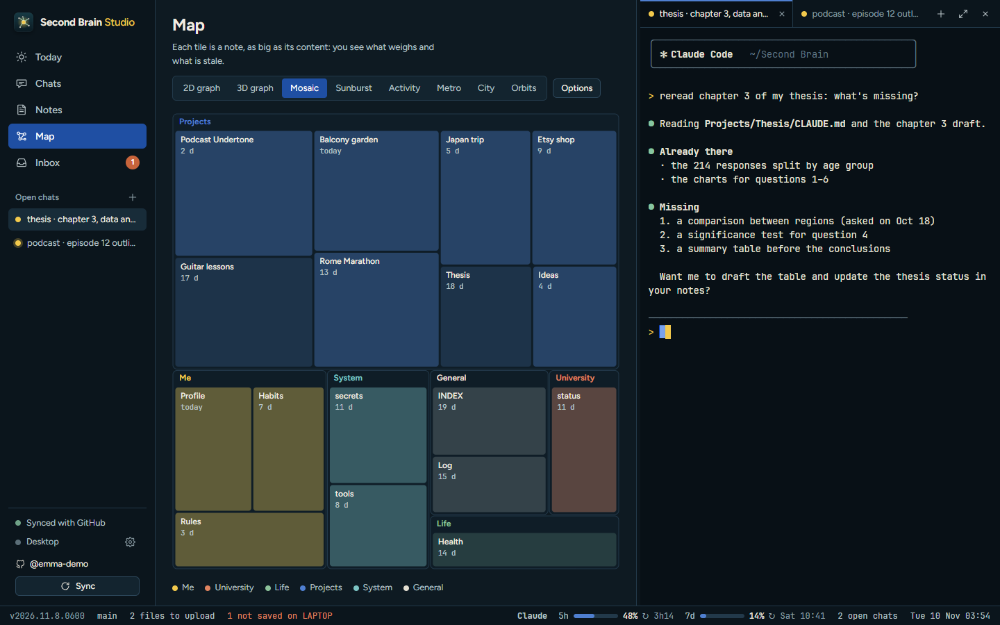<br><b>Mosaic</b>: every tile as big as its note</td>
<td>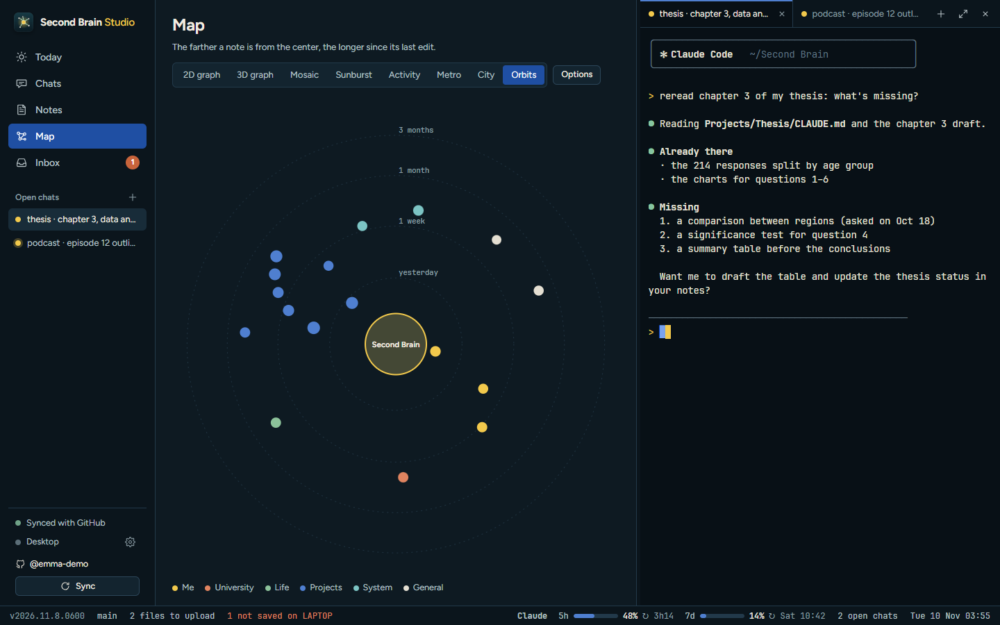<br><b>Orbits</b>: the farther out, the longer since the last edit</td>
</tr>
</table>
</details>

### Under the hood

| | |
|---|---|
| 🖥️ **Real Claude Code** | `claude.exe` in a real pseudo-console (xterm.js + ConPTY): colors, Shift+Enter, slash commands, status line. |
| 📝 **Automatic notes** | A `SessionEnd` hook summarizes the transcript and has Claude update the log and status files in the background. Closing a tab lets Claude exit cleanly, so nothing is lost. |
| 🔔 **Notifications you can click** | Windows toasts with project, chat and a preview of the reply. Click one and the right tab opens. |
| 🔄 **GitHub sync built in** | Device-code sign-in (the app never sees your password), private repo creation, one-click sync, conflicts handed to Claude. |
| 💻 **Multi-PC chat status** | Each PC publishes a tiny summary of its chats (keywords, times, status, never the messages) to a branch of your repo. |
| ⬆️ **Self-updating** | New releases are downloaded and checked (size + SHA-256) in the background; one click installs them and reopens your chats. |
| 📊 **Plan usage** | Your 5-hour and weekly Claude usage in the status bar. Needs a Claude subscription (Pro or Max): with an API key Claude Code doesn't report it. If you already have your own Claude Code status line, the bars arrive with the next version (your line stays as it is). |
| 🌍 **English and Italian** | Switch the interface language in Settings → General. |
| 🌗 **Dark and light** | "Chiostro di Santa Chiara" majolica palette: cobalt, lemon, verdigris and terracotta. |

<div align="center">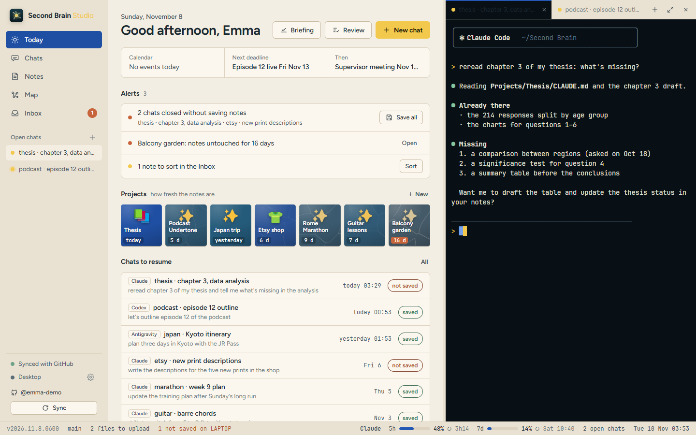</div>

## How it works

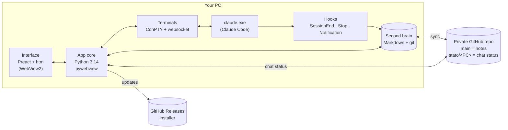
```mermaid
flowchart LR
    subgraph PC["Your PC"]
        UI["Interface<br/>Preact + htm<br/>(WebView2)"]
        Core["App core<br/>Python 3.14<br/>pywebview"]
        Term["Terminals<br/>ConPTY + websocket"]
        CC["claude.exe<br/>(Claude Code)"]
        Notes[("Second brain<br/>Markdown + git")]
        Hooks["Hooks<br/>SessionEnd · Stop · Notification"]
    end
    GH[("Private GitHub repo<br/>main = notes<br/>stato/&lt;PC&gt; = chat status")]
    Rel[("GitHub Releases<br/>installer")]

    UI <--> Core
    Core <--> Term <--> CC
    CC --> Hooks --> Notes
    Core <--> Notes
    Notes <-->|sync| GH
    Core <-->|chat status| GH
    Core -->|updates| Rel
```

### The life of a chat

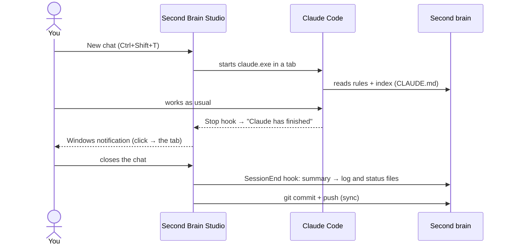
```mermaid
sequenceDiagram
    actor You
    participant App as Second Brain Studio
    participant Claude as Claude Code
    participant Notes as Second brain
    You->>App: New chat (Ctrl+Shift+T)
    App->>Claude: starts claude.exe in a tab
    Claude->>Notes: reads rules + index (CLAUDE.md)
    You->>Claude: works as usual
    Claude-->>App: Stop hook → "Claude has finished"
    App-->>You: Windows notification (click → the tab)
    You->>App: closes the chat
    App->>Notes: SessionEnd hook: summary → log and status files
    App->>Notes: git commit + push (sync)
```

### Chats from your other PCs

No extra programs and no server of ours: everything goes through the private repository you already have.

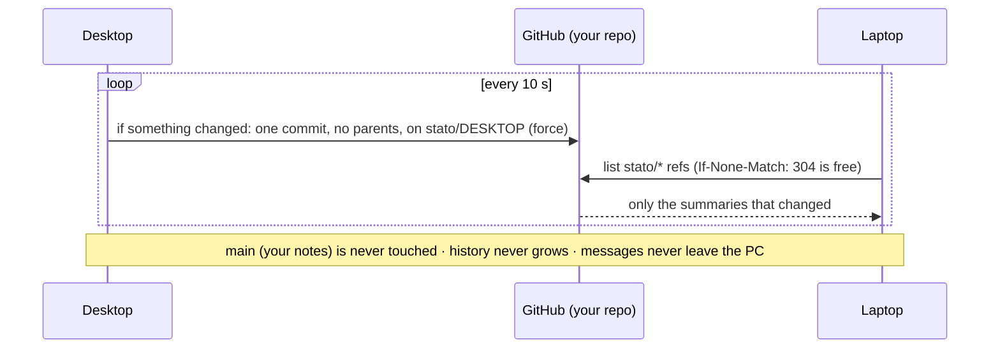
```mermaid
sequenceDiagram
    participant A as Desktop
    participant GH as GitHub (your repo)
    participant B as Laptop
    loop every 10 s
        A->>GH: if something changed: one commit, no parents, on stato/DESKTOP (force)
        B->>GH: list stato/* refs (If-None-Match: 304 is free)
        GH-->>B: only the summaries that changed
    end
    Note over A,B: main (your notes) is never touched · history never grows · messages never leave the PC
```

## Install

1. **Requirements**: Windows 10 or 11, [Claude Code](https://docs.claude.com/en/docs/claude-code/setup) signed in, [Git for Windows](https://git-scm.com/download/win).
2. **Download** `Second Brain Studio Setup <version>.exe` from the [latest release](https://github.com/Axelina23/second-brain-studio/releases/latest) and run it.
   It installs for your user only: no administrator rights.
3. **"Windows protected your PC"?** The installer isn't code-signed yet, so SmartScreen warns about it.
   Click **More info**, then **Run anyway**. GitHub shows the SHA-256 of every release file if you want to check it.
4. **First run**: create a new second brain, adopt an existing folder, or download yours from GitHub.

After that the app updates itself. Test builds (marked *Pre-release*) only arrive if you turn on
*Include preview versions* in Settings → General → Updates.

### Build from source

```powershell
git clone https://github.com/Axelina23/second-brain-studio
cd second-brain-studio
py -3.14 -m pip install --user -r app\requirements.txt
python -m pytest -q                             # tests
python app\main.py --debug                      # run from source
winget install JRSoftware.InnoSetup             # only to build the installer
powershell -ExecutionPolicy Bypass -File app\build.ps1
```

UI without Python: `python -m http.server 8765 -d app\web`, then open `http://127.0.0.1:8765/prova.html`
(`?demo` for open chats, `?en` for English, `?primo` for the first run). All data there is made up.
The README screenshots and the GIF come from the same page: `docs\immagini\screenshot.ps1`.

## Project layout

```
app/            desktop app: window, terminals, GitHub, updates, notifications, interface (web/)
  hooks/        PowerShell hooks installed for Claude Code (end of session, alerts, sync)
  web/          Preact + htm interface, no build step; vendor/ holds xterm.js, marked, DOMPurify
motore/         the engine: sessions, keywords, notes, freshness, sync status (pure Python, tested)
docs/           images and maintainer notes
```

## FAQ

**Does it use the API or my Claude subscription?**
It runs each installed CLI with its own authentication and billing. Claude Code supports its existing subscription, API key, Bedrock or Vertex setup; Codex and Antigravity use their own accounts.

**Where are my notes?**
In a normal folder you choose, as Markdown files. Uninstalling the app leaves them where they are.

**What does the folder look like?**
Created in English, it's `INDEX.md` and `CLAUDE.md` at the top, then `Me/` (rules and profile), one folder per area
you picked (`Work/`, `Family/`…), `Projects/<Name>/CLAUDE.md`, `Archive/Log.md`, `System/` and `Inbox/`.
In Italian the same structure has Italian names (`INDICE.md`, `Io/`, `Progetti/`…). The language is chosen on the first
screen and stays with that second brain even if you switch the app's language later.

**What exactly goes to GitHub?**
Your notes (to your private repo, like any git repo) and, if the multi-PC view is on, a small JSON per PC with chat
keywords, times and save status. Never the content of your chats.

**Why does Windows warn me about the installer?**
Code-signing certificates cost money every year and this is a free project, so the installer isn't signed.
SmartScreen warns about unsigned files that few people have downloaded yet. If you'd rather not trust a binary,
the source and the build script are all here.

**Mac?**
Planned. The engine is cross-platform; the terminal and the installer are the Windows-specific parts.

## Contributing

Bug reports, ideas and small fixes are welcome: see [CONTRIBUTING.md](CONTRIBUTING.md).
Questions go to [Discussions](https://github.com/Axelina23/second-brain-studio/discussions).
What changed in each version: [CHANGELOG.md](CHANGELOG.md).

## Support

Second Brain Studio is free and I build it in my spare time. If it saves you time, a coffee helps a lot.

[](https://ko-fi.com/N0Z52A98V1)

## License

[PolyForm Noncommercial 1.0.0](LICENSE.md): free to use, change and share for any noncommercial purpose.
Nobody may sell it. Emblem icons: Microsoft Fluent Emoji (MIT). Terminal: xterm.js. Interface: Preact.
